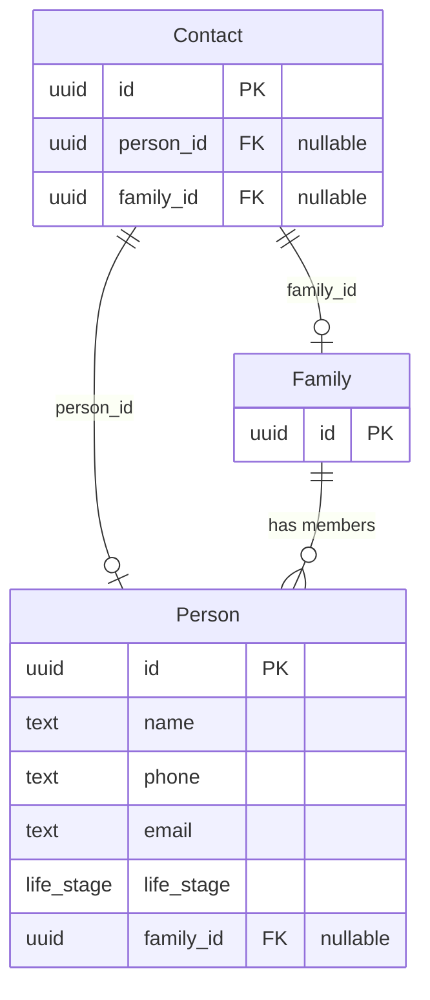
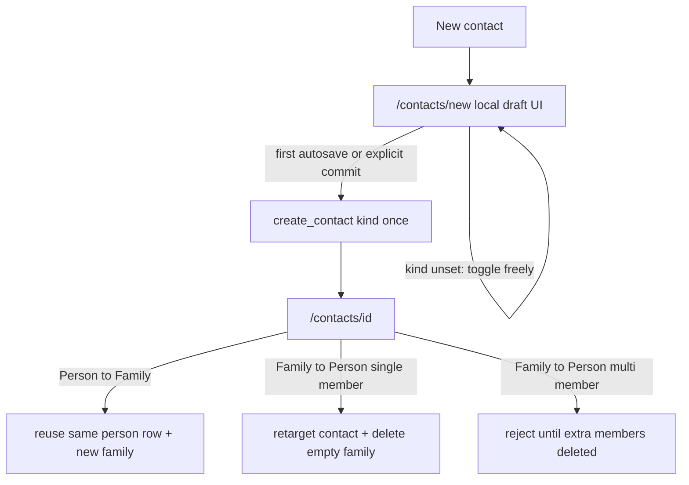

# People, families, and contacts

## Goals

- Introduce three domain types: **Person**, **Family**, **Contact**.
- Contacts remain the UI surface (list cards + detail route).
- A contact points at **either** a person **or** a family (exactly one).
- People hold name, email, phone, life stage.
- Life stages become: `child`, `young_adult`, `parent`, `older`.
- A person belongs to **at most one** family (`person.family_id` nullable for standalone person contacts).
- Family detail edits **all** members; children hide email/phone in the UI only (no DB constraint).
- Family display name is **out of scope** for this change (derive card title from members for now).

## Domain model



**Invariants (app + DB check):**

- Contact: exactly one of `person_id` / `family_id` is non-null.
- Person: `family_id` null means standalone (person contact target), not a family member.
- At most one family per person (single FK, not a join table).

**Out of scope for this pass (do not implement):**

- Leaving a family / becoming a standalone adult contact (`leave_family`, unlink `family_id` while keeping the person).
- Creating a new contact that points at an existing person who left a family.
- Converting a family contact back into a person contact.

Schema still uses nullable `family_id` so that path can be added later without another structural migration.

## Database migration

Replace the flat `customer` table with the new schema. Prefer a single forward migration that:

1. Creates new enum / alters `life_stage`:
   - New values: `child`, `young_adult`, `parent`, `older`.
   - Map existing rows: `young` → `young_adult`, `has_kids` → `parent`, `older` → `older`.
   - Postgres enum changes are awkward; practical approach:
     - Add new type `life_stage_v2`, migrate column, drop old type, rename; **or**
     - Store as `TEXT` + check constraint for simplicity going forward.
2. Create `family (id UUID PRIMARY KEY)`.
3. Create `person (id, name, phone, email, life_stage, family_id NULL REFERENCES family(id) ON DELETE CASCADE)`.
   - `ON DELETE CASCADE`: deleting a family removes its members (no orphan “left family” people in this pass).
4. Create `contact (id, person_id NULL REFERENCES person, family_id NULL REFERENCES family, CHECK xor person/family)`.
5. Data migrate from `customer`:
   - Each existing customer → one `person` + one `contact` with `person_id`.
6. Drop `customer`.

Indexes: `person(name)`, `person(family_id)`, `contact(person_id)`, `contact(family_id)`.

## Rust models ([`src/models.rs`](src/models.rs))

```rust
enum LifeStage { Child, YoungAdult, Parent, Older }

struct Person {
    id, name, phone, email,
    life_stage: Option<LifeStage>,
    family_id: Option<Uuid>,
}

struct Family {
    id: Uuid,
    // members loaded separately or embedded in FamilyDetail
}

enum ContactTarget {
    Person(Uuid),
    Family(Uuid),
}

struct Contact {
    id: Uuid,
    target: ContactTarget, // or person_id + family_id Option pair
}

/// List/card DTO assembled server-side (not a table row)
struct ContactCard {
    id: Uuid,
    kind: Person | Family,
    title: String,              // person name, or joined non-child names
    child_names: Vec<String>,   // family only
    // For icons / status:
    emails: Vec<String>,        // from person, or non-child members
    phones: Vec<String>,
    life_stages: Vec<Option<LifeStage>>, // person: one; family: non-children (and maybe children for icons later)
}
```

**Detail DTO:**

```rust
enum ContactDetail {
    Person { contact_id, person: Person },
    Family { contact_id, family_id, members: Vec<Person> },
}
```

Helpers: `LifeStage::is_child()`, `Person::shows_contact_info()` → not child (UI only).

## Server API ([`src/server.rs`](src/server.rs))

Keep autosave-as-updates philosophy; drafts still work.

| Function | Behavior |
|----------|----------|
| `list_contacts(query)` | Join contact → person/family+people; build `ContactCard`; filter empty titles; name search across person names / member names |
| `get_contact_detail(id)` | Return `ContactDetail` |
| `create_contact(kind: Person \| Family)` | Insert family (if needed) + draft person(s) + contact; return contact id. Called once when local draft first persists. |
| `update_person(...)` | Autosave person fields |
| `add_family_member(family_id)` | Insert empty person with `family_id`, return person |
| `delete_family_member(person_id)` | **Delete** the person row (must belong to a family). Not an unlink/leave. |
| `convert_contact_to_family(contact_id)` | Person → Family in place (reuse person row). |
| `convert_contact_to_person(contact_id)` | Family → Person when exactly one member; delete empty family. Error if 2+ members. |
| `delete_contact(id)` | Delete contact; if person-target, delete that person; if family-target, delete family (members cascade) |

**Do not add:** `leave_family`, `create_contact_for_person`, or any API that nulls `family_id` while keeping the person as a free-floating directory entry outside convert-to-person.

**Create draft rules:**

- **Person contact:** insert `person` (empty, `family_id` null) + `contact(person_id)`.
- **Family contact:** insert `family` + one empty `person` (`family_id` set) + `contact(family_id)`. UI can add more members.

**Abandon empty:**

- Person contact empty → `delete_contact` (person goes with it).
- Family contact: all members empty → `delete_contact` (family + members cascade).
- Partial family with some filled members → keep.

**List card projection:**

- Person: title = name; email/phone/life_stage from that person; no child_names.
- Family: title = join non-child names (e.g. `"Alex & Sam"`); `child_names` = children; emails/phones = all non-child emails/phones that are non-empty; contact-info icon from aggregated completeness among non-children.

## Kind toggle and avoiding dead rows

Problem: if “New contact” inserts a draft immediately, then the user flips Person ↔ Family, naive creates would orphan people/families.

**Chosen approach: defer DB create until kind is chosen; convert in place afterward.**



### 1. Pre-create: no DB rows yet

- Home “New contact” navigates to a **client-only** new-contact route (e.g. `/contacts/new`), **not** `create_contact()`.
- User can toggle Person / Family freely; nothing is written.
- On **first autosave** (or when leaving with any non-empty field): call `create_contact(kind)` once, then replace the URL with `/contacts/{id}` (history `replace` so Back does not return to the empty local draft).
- Back with still-empty local state: navigate home; **zero** inserts.

### 2. Post-create: convert in place (reuse rows)

Never “create a second draft and abandon the first.” One contact id for the session.

| Toggle | Server behavior |
|--------|-----------------|
| **Person → Family** | In one transaction: insert `family`; set `person.family_id`; set `contact.family_id`, clear `contact.person_id`. **Same person row.** |
| **Family → Person** (exactly one member) | In one transaction: clear `person.family_id`; set `contact.person_id`, clear `contact.family_id`; **delete** the now-empty `family`. |
| **Family → Person** (2+ members) | Reject; user must `delete_family_member` extras first (those deletes remove person rows, which is intentional). |

Flipping back and forth with a single member only creates/deletes a lightweight `family` row; the person and contact rows stay put. No pile of dead people.

### 3. Abandon after create

Unchanged: empty person contact → delete contact + person; empty family contact → delete contact + family (members cascade).

### API shape

- `create_contact(kind)` — still one-shot draft insert (used after kind is known).
- `convert_contact_to_family(contact_id)` — Person → Family wrap.
- `convert_contact_to_person(contact_id)` — Family → Person when a single member; error otherwise.

These conversion endpoints **replace** any earlier idea of deleting one draft and creating another on toggle.

## Frontend structure

Keep routes: `/` list, `/contacts/new` (local draft), `/contacts/:id` (persisted).

### Home ([`src/views/home.rs`](src/views/home.rs))

- “New contact” → `/contacts/new` (no server create).
- Cards use `ContactCard`: show title; for families show child names muted; icons from aggregated emails/phones + life-stage glyph(s).

### Detail ([`src/views/contact_detail.rs`](src/views/contact_detail.rs))

**Shared chrome:** back caret, autosave status.

**Kind toggle** (always visible on new + existing drafts):

- Before persist: toggle only flips local UI state.
- After persist: toggle calls `convert_contact_to_family` / `convert_contact_to_person` (see table above); refresh detail DTO.

**Person mode:** name, email, phone, life-stage picker (four values). Hide email/phone when life stage is `child`.

**Family mode:**

- List of member editors (one block per person).
- Each block: name, life stage; if not child → email, phone.
- “Add person” → `add_family_member`.
- “Remove” → `delete_family_member` (deletes that person; do not offer “leave family”).
- Autosave per-person via `update_person` (debounce per member id).

### Components

- Update [`LifeStage`](src/components/life_stage.rs) picker/icons for four stages with four glyphs.
- Card icons: adapt `ContactInfoStatus` to aggregated emails/phones on `ContactCard`.
- New `PersonEditor` component used by person contact and each family member.

### CSS

- Member sections stacked with light separation (not card-heavy).
- Kind toggle / chooser as segmented control.
- Child rows visually simpler (name + stage only).

## Implementation phases

1. **Schema + models** — migration, `Person`/`Family`/`Contact`/`ContactCard`/`ContactDetail`, life stage enum remap.
2. **Server** — list/detail/create/update person/add member/delete member/delete contact/convert kind; stop reading `customer`.
3. **Shared UI** — life stage four-way; `PersonEditor`; card projection.
4. **Detail rewrite** — `/contacts/new` local draft, kind toggle + convert APIs, per-person autosave, abandon rules.
5. **Home** — consume `ContactCard`; new-contact navigates to local draft.
6. **Cleanup** — remove old flat `Contact` field usage.

## Explicit non-goals (this pass)

- Family display name field.
- Multi-family membership.
- Leaving a family / unlinking a person while keeping them (except the narrow Family→Person convert when a family has exactly one member, which deletes the empty family wrapper).
- Enforcing “children have no email/phone” in the database.
- Parish features beyond directory (events, etc.) — only the building blocks.

## Key files to touch

| Area | Files |
|------|--------|
| DB | new `migrations/003_people_families_contacts.sql` |
| Models | [`src/models.rs`](src/models.rs) |
| API | [`src/server.rs`](src/server.rs) |
| Views | [`src/views/home.rs`](src/views/home.rs), [`src/views/contact_detail.rs`](src/views/contact_detail.rs) |
| Components | [`src/components/life_stage.rs`](src/components/life_stage.rs), new `person_editor.rs`, [`contact_info_icon.rs`](src/components/contact_info_icon.rs) |
| Styles | [`style/main.css`](style/main.css) |
